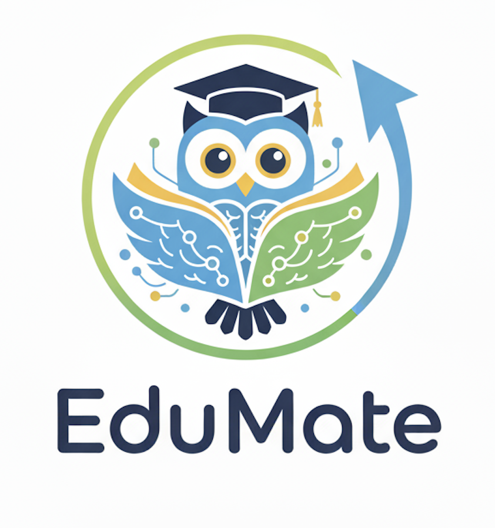
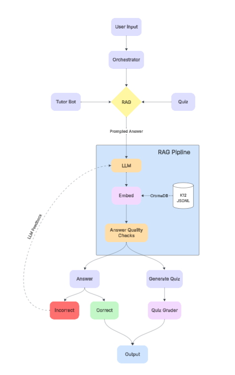

<div align="center">

<a name="readme-top"></a>

<!-- Project banner -->


# ✨ **EduMate**

**K**nowledge-grounded  
**12**-grade aware  
**R**etrieval-**A**ugmented **G**eneration  
**Tutor • Quiz • Parent Dashboard**

**[🚀 Live Demo](https://project-check-point-1-edumate.vercel.app/login)** | **[📖 Documentation](./docs/FINAL_REPORT.md)** | **[🔧 Installation Guide](./application/INSTALL.md)**

*Making learning addictive — the right way.*

[](#)
[](#)
[](#)
[](#)
[](#)
[](#)
[](#)
[](#)

</div>

---

## 🌐 Deployed Application

**🔗 Live URL:** [https://project-check-point-1-edumate.vercel.app/login](https://project-check-point-1-edumate.vercel.app/login)

The application is fully deployed and ready to use. You can create an account and start exploring the features immediately!

---

## 📑 Table of Contents
1. [Problem Statement and Why It Matters](#-problem-statement-and-why-it-matters)  
2. [Target Users and Core Tasks](#-target-users-and-core-tasks)  
3. [Key Features](#-key-features)  
4. [Tech Stack](#-tech-stack)  
5. [Quick Start](#-quick-start)  
6. [Competitive Landscape & AI Limitations](#-competitive-landscape--ai-limitations)  
7. [Literature Review](#-literature-review)  
8. [Initial Concept and Value Proposition](#-initial-concept-and-value-proposition)  
9. [Workflow Overview](#-workflow-overview)  
10. [Architecture Overview](#-architecture-overview)  
11. [Project Structure](#-project-structure)  
12. [Documentation](#-documentation)  
13. [License](#-license)

---

## 🆘 Problem Statement and Why It Matters
Students need **instant, reliable, grade-level help** outside class. Generic chatbots hallucinate and aren't aligned to standards; parents rarely see **which skills improved** and **where their child struggles**.  
**EduMate** is a **RAG-grounded** tutor + quiz system that:
- explains **with LaTeX and examples**,
- generates **curriculum-aligned quizzes** with **auto-grading + rationales**, and
- provides a **Parent Dashboard** with **trends, gaps, and recommendations**.

---

## ✨ Key Features

### 🎓 Three Core Learning Modules

1. **S1: Structured Problem-Solving Practice**
   - Grade and topic selectors (1-12)
   - AI-generated or custom questions
   - Phased solutions: Understand → Strategy → Step-by-step LaTeX → Verify → Alternates
   - Interactive learning with guided hints

2. **S2: AI-Powered Solution Feedback**
   - Text or file uploads with OCR preview
   - "Hints-first" mode or Direct Answer (parent-controlled)
   - Error annotations and fix-it tips
   - Precise guidance on mistakes

3. **S3: Mathematical Quiz Generation**
   - Grade-aware topic selection
   - Misconception-based distractors
   - Optional "Check Answer" feature
   - Detailed results and explanations
   - Progress tracking with visual indicators

### 👨‍👩‍👧 Parent Dashboard
- **Progress Analytics:** Accuracy over time, topic heatmap, time-on-task
- **Control Settings:** Toggle Direct Answer, fix question count, lock difficulty, set daily goals
- **Activity Tracking:** Recent activity logs and exportable summaries
- **Recommendations:** AI-powered insights on student strengths and areas for improvement

### 🔒 Academic Integrity Features
- Parent-controlled Direct Answer mode
- Question generation permissions
- Difficulty locking
- Daily goal settings
- Transparent progress reporting

---

## 🛠️ Tech Stack

### Frontend
- **Framework:** Next.js 15.2 (React 18)
- **Language:** TypeScript
- **Styling:** Tailwind CSS
- **UI Components:** Radix UI, shadcn/ui
- **Math Rendering:** KaTeX for LaTeX
- **Charts:** Recharts
- **Testing:** Playwright (E2E)

### Backend
- **Framework:** FastAPI (Python 3.8+)
- **LLM:** Groq (GPT-OSS-20B)
- **Vector Database:** ChromaDB (DuckDB + Parquet)
- **Embeddings:** SentenceTransformers
- **Database:** PostgreSQL with pgvector extension
- **API:** RESTful architecture

### Infrastructure
- **Frontend Deployment:** Vercel
- **Backend Deployment:** Render
- **Database:** Supabase (PostgreSQL) or local PostgreSQL
- **Vector Storage:** Local ChromaDB with persistent storage

---

## 🚀 Quick Start

### Prerequisites
- Node.js (v18 or higher)
- Python (v3.8 or higher)
- PostgreSQL (v12 or higher) or Supabase account
- Groq API key ([Get one here](https://console.groq.com/))

### Installation

1. **Clone the repository**
   ```bash
   git clone <repository-url>
   cd project-check-point-1-edumate/application
   ```

2. **Set up environment variables**
   ```bash
   cp env.example .env
   # Edit .env and add your API keys
   ```

3. **Install dependencies**
   ```bash
   # Frontend
   npm install
   
   # Backend
   python -m venv venv
   source venv/bin/activate  # macOS/Linux
   # or venv\Scripts\activate  # Windows
   pip install -r requirements.txt
   ```

4. **Set up database**
   - Create a PostgreSQL database (or use Supabase)
   - Enable pgvector extension: `CREATE EXTENSION IF NOT EXISTS vector;`
   - Update `DATABASE_URL` in `.env`

5. **Initialize ChromaDB**
   ```bash
   python backend/setup_chroma.py
   ```

6. **Run the application**
   ```bash
   # Option 1: Use the start script
   chmod +x start.sh
   ./start.sh
   
   # Option 2: Use npm
   npm run dev:full
   ```

7. **Access the application**
   - Frontend: http://localhost:3000
   - Backend API: http://localhost:8000
   - API Docs: http://localhost:8000/docs

For detailed installation instructions, see [INSTALL.md](./application/INSTALL.md).

---

## 🎯 Target Users and Core Tasks

| **User** | **Primary Goal** | **What EduMate Provides** |
|---|---|---|
| **K–12 Students** | Learn effectively with the right level of support | **S1 Structured Practice** with grade/topic selectors, AI-generated or custom questions, and phased solutions (Understand → Strategy → Step-by-step LaTeX → Verify → Alternates). |
| **Students uploading their work** | Get precise guidance on mistakes | **S2 Solution Feedback** with text/file uploads (OCR preview), “Hints-first” mode, or **Direct Answer** (if parent-enabled), plus error annotations and fix-it tips. |
| **Students preparing for tests** | Targeted practice and quick assessment | **S3 Quiz Generation** with grade-aware topics, **misconception-based distractors**, optional “Check Answer,” progress dots, and detailed results/explanations. |
| **Parents / Guardians** | Control the learning environment & see progress | **Parent Portal Controls:** toggle Direct Answer (S2), allow/disallow S1 question generation, **fix question count**, **lock difficulty**, set daily goals. **Dashboard:** accuracy over time, topic heatmap, time-on-task, recent activity; export summaries. |
| **After-school staff / Tutors** | Monitor groups and run structured practice | Quick-start quiz presets by grade/topic, view attempt summaries, downloadable reports, and visibility into parent-locked settings for consistent sessions. |

---

## 🏁 Competitive Landscape & AI Limitations

| Platform                  | Strengths                               | Limitations                                                                 |
|----------------------------|-----------------------------------------|------------------------------------------------------------------------------|
| **Khan Academy / Khanmigo** | Great pedagogy                         | Limited custom RAG sources and parent analytics                              |
| **ChatGPT / Gemini**       | Flexible                                | Ungrounded; not grade-tuned; no per-skill reporting                          |
| **Photomath / Socratic**   | Solid step-by-step solutions            | Not a full tutor with mastery tracking                                       |
| **Perplexity**             | Provides citations                      | Citations ≠ tutoring; lacks student model and practice loop                  |
| **EduMate’s Edge**         | Retrieval-grounded answers, grade-aware explanations, auto-graded quizzes, Parent Dashboard | Converts activity into insight and action |

---

## 📚 Literature Review

- Effective learning with a personal AI tutor: A case study
- ARTIFICIAL INTELLIGENCE (AI) IN EDUCATION: USING AI TOOLS FOR TEACHING AND LEARNING PROCESS
- Designing an AI driven intelligent Tutorial System
- Tutor CoPilot: A Human-AI Approach for Scaling Real-Time Expertise
- Intelligent Tutoring Systems Powered by Generative AI: Advancing Personalized Education and Overcoming Challenges
- A systematic review of AI-driven intelligent tutoring systems (ITS) in K-12 education
- AI Driven Tutoring vs. Human Teachers Examining the on Student Teacher Relationship
- Investigating dialogic interaction in K12 online one-on-one mathematics tutoring using AI and sequence mining techniques

---

## 🚀 Initial Concept and Value Proposition

EduMate is a next-generation AI-driven tutoring platform designed to bridge the growing gap in K–12 education by combining Retrieval-Augmented Generation (RAG), multi-agent orchestration, and student progress tracking. Unlike generic AI assistants that provide quick answers, EduMate is built around pedagogical depth: guiding students through concepts, verifying correctness, and ensuring lasting comprehension.

At its heart lies an Orchestrator Agent that dynamically routes user input into two learning pathways:

**Tutor Bot** – Interactive, conversational help where students can ask questions and receive step-by-step Socratic guidance.

**Quiz Module** – Automatically generated, adaptive quizzes tailored to the student’s grade level, difficulty preferences, and learning history.

Both pathways feed into a RAG pipeline that ensures reliable, curriculum-aligned answers by combining large language models (LLMs) with a structured K–12 knowledge base stored in ChromaDB.

### 🔑 Key Value Propositions:
1. **Personalized AI Tutoring**  
   - Uses retrieval from **K–12 ChromaDB knowledge base**.  
   - Answers are step-based, with explanations instead of shortcuts.  

2. **Integrated Quiz System**  
   - Dynamically generates quizzes by grade, topic, and difficulty.  
   - Auto-grades responses and provides detailed explanations.  

3. **Parent & Educator Dashboards**  
   - Tracks progress, highlights strengths/weaknesses.  
   - Builds trust that EduMate is *teaching*, not *cheating*.  

4. **Answer Quality Assurance**  
   - All outputs undergo quality checks (accuracy, grade alignment).  
   - Incorrect answers trigger corrective hints and re-learning loops.  

---

## 📊 Workflow Overview  

### 📌 Architecture Screenshot 



The EduMate architecture follows a structured Orchestrated + RAG-enabled pipeline designed to support tutoring and quiz-based learning:

## User Input
A student, parent, or staff member interacts with the system (e.g., asks a question, requests a quiz).

## Orchestrator
The Orchestrator agent classifies the task:

- If it’s a help request or question, it routes to the Tutor Bot.  
- If it’s a quiz request or answer submission, it routes to the Quiz Module.

## RAG Pipeline
Both paths leverage the RAG (Retrieval-Augmented Generation) pipeline for accuracy.

**Steps inside RAG:**
- **Embedding:** The query is embedded into vector form.  
- **ChromaDB Retrieval:** Relevant K–12 content (JSONL knowledge base) is fetched.  
- **LLM Processing:** An LLM uses the retrieved context to draft an answer.  
- **Answer Quality Checks:** The output is verified for factual correctness, grade-level suitability, and clarity.  

## Tutor Bot Path
- Provides step-by-step guidance, explanations, and hints instead of direct answers.  
- Uses LLM reinforcement for improving weak or unclear answers.  

## Quiz Path
- **Quiz Generation:** Creates adaptive questions based on topic, grade, and difficulty.  
- **Quiz Grader:** Evaluates student submissions, highlights correct/incorrect answers, and provides detailed explanations.  

## Feedback & Learning Loop
- **Correct answers** → reinforce progress and update student profile.  
- **Incorrect answers** → trigger corrective hints and explanations.  
- Parent/educator dashboards display weekly progress reports, quiz outcomes, and learning trends.  

## Output
- Students receive answers, quizzes, or reports.  
- Parents receive progress dashboards.  
- Educators receive tracking and grading support.  

---

## 🏗️ Architecture Overview

**Frontend (React)**  
- Tutor view (grade slider + LaTeX rendering)  
- Quiz view (generate → answer → check → submit)  
- Parent Dashboard (progress & recommendations)

**Backend (FastAPI)**  
- `/ask` → RAG answer (Groq + ChromaDB)  
- `/quiz/generate` → AI-generated MCQs (JSON-only)  
- `/quiz/grade` → scoring + rationales  
- `/parent/*` → progress summaries & suggestions

**RAG Pipeline**  
1. **Embed** query with `SentenceTransformer`  
2. **Retrieve** top-k from **ChromaDB (DuckDB+Parquet persist)**  
3. **Compose** with Groq (`openai/gpt-oss-20b`) + **grade hint**  
4. **Return** Markdown + LaTeX (`$$...$$` blocks, `$...$` inline)

**Data**  
- `Attempt(student_id, item_id, selected, is_correct, ts)`  
- `QuizItem(id, topic, grade, skill_tag, choices{A..D}, correct)`  
- `SessionLog(student_id, minutes, date)`

---

## 📁 Project Structure

```
project-check-point-1-edumate/
├── application/                 # Main application directory
│   ├── app/                    # Next.js app directory
│   │   ├── login/              # Login page
│   │   ├── student/            # Student dashboard and modules
│   │   ├── parent/             # Parent dashboard
│   │   └── profile/            # User profile
│   ├── backend/                # FastAPI backend
│   │   ├── main.py             # FastAPI application
│   │   ├── database.py         # Database models and operations
│   │   ├── rag_groq_bot.py     # RAG pipeline implementation
│   │   ├── quiz_gen.py         # Quiz generation logic
│   │   └── setup_chroma.py     # ChromaDB initialization
│   ├── components/             # React components
│   │   ├── ui/                 # shadcn/ui components
│   │   ├── math-renderer.tsx   # LaTeX math renderer
│   │   └── feedback-display.tsx # Solution feedback UI
│   ├── lib/                    # Utility libraries
│   │   ├── api-service.ts      # API client
│   │   └── hybrid-service.ts   # Hybrid RAG service
│   ├── data/                   # Dataset files
│   │   ├── test.jsonl          # K-12 mathematics dataset
│   │   └── test_without_grade1.jsonl
│   ├── e2e/                    # End-to-end tests
│   ├── chroma_db/              # ChromaDB storage
│   └── INSTALL.md              # Installation guide
├── docs/                       # Documentation
│   ├── FINAL_REPORT.md         # Comprehensive project report
│   ├── prompts.md              # Prompt engineering documentation
│   ├── Architecture/           # Architecture diagrams
│   └── images/                 # Screenshots and diagrams
├── artifact/                   # Artifact package
│   ├── ARTIFACT.md             # Main artifact documentation
│   ├── CONFIGURATION.md        # Configuration guide
│   ├── DATA_ACCESS.md          # Data access instructions
│   └── prompts/                # Extracted prompt files
└── README.md                   # This file
```

---

## 📚 Documentation

### Core Documentation
- **[Final Report](./docs/FINAL_REPORT.md)** - Comprehensive project documentation including methodology, evaluation, and results
- **[Installation Guide](./application/INSTALL.md)** - Detailed setup instructions
- **[Prompt Documentation](./docs/prompts.md)** - RAG and quiz generation prompts

### Artifact Package
- **[Artifact Summary](./artifact/ARTIFACT_SUMMARY.md)** - Overview of artifact package contents
- **[Configuration Guide](./artifact/CONFIGURATION.md)** - Environment and deployment configuration
- **[Data Access](./artifact/DATA_ACCESS.md)** - Dataset access and usage instructions

### Architecture & Design
- **[Architecture Diagrams](./docs/Architecture/)** - System architecture and flow diagrams
- **[Design Specification](./DESIGN_SPEC.md)** - Detailed design specifications

### Testing
- **[E2E Tests](./application/e2e/)** - Playwright end-to-end test suites
- Test coverage for authentication, student modules, and parent dashboard

### Additional Resources
- **Literature Review:** See `literature/` directory for research papers
- **Validation:** See `validation/` directory for user validation results
- **Proposal:** See `proposal/` directory for initial project proposal

---

## 🧪 Testing

### End-to-End Tests
```bash
# Run all E2E tests
npm run test:e2e

# Run with UI
npm run test:e2e:ui

# Run in headed mode
npm run test:e2e:headed
```

### Test Coverage
- Authentication flow
- Student dashboard navigation
- S1, S2, S3 module functionality
- Parent dashboard features

---

## 📊 Evaluation Results

### Comparative Evaluation
- **ChatGPT (GPT-5):** 24/25 on comprehensive rubric
- **Gemini (2.5 Pro):** 22/25
- **Perplexity (SONAR):** 17/25

### User Survey (N=5)
- **Overall Ease of Use:** 100% "Useful" or "Very useful"
- **Student Dashboard:** 100% "Very useful"
- **S1 & S2 Modules:** 100% "Useful" or "Very useful"
- **Primary Improvement:** Load speed optimization

### System Performance
- **API Response Times:**
  - Tutoring: 1-2 seconds
  - Quiz Generation: 2-3 seconds
  - Quiz Grading: <100ms
- **Vector Search:** 15-50ms
- **Error Rates:** <2%

For detailed evaluation results, see [FINAL_REPORT.md](./docs/FINAL_REPORT.md).

---

## 🤝 Contributing

This is a research project, but contributions and feedback are welcome! If you'd like to contribute:

1. Fork the repository
2. Create a feature branch
3. Make your changes
4. Submit a pull request

---

## 📝 License

Distributed under the **Apache 2.0** License. 

<div align="right">

[⬆️ Back to top](#readme-top)

</div>
