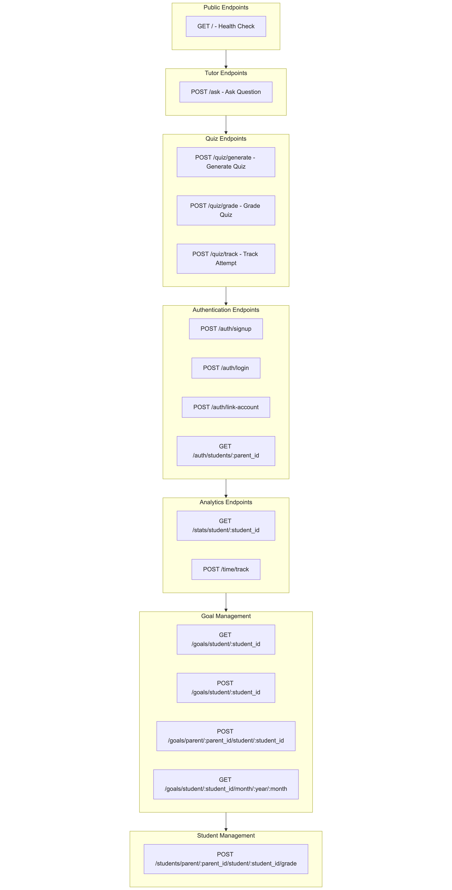
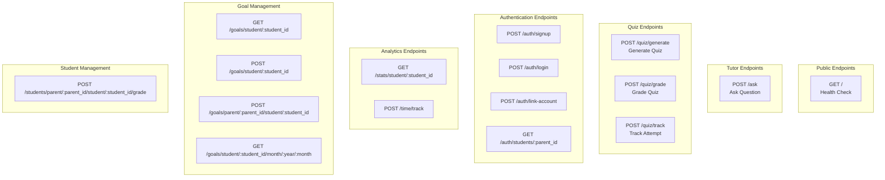
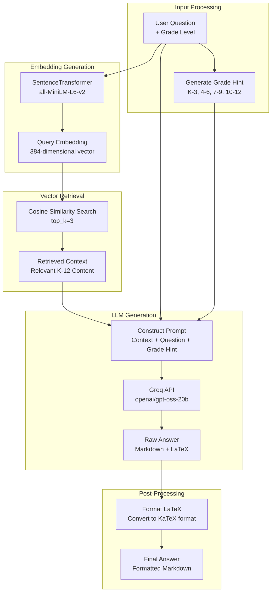
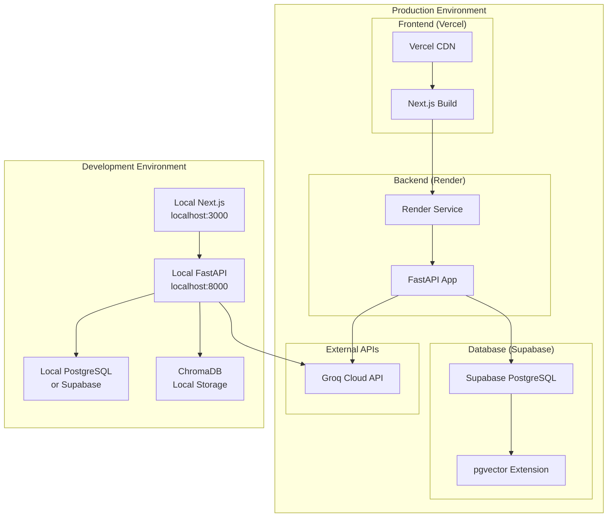

# EduMate Architecture Documentation

This document provides a comprehensive overview of the EduMate system architecture, including component interactions, data flows, and technology stack.

## Table of Contents

1. [System Overview](#system-overview)
2. [High-Level Architecture](#high-level-architecture)
3. [Component Architecture](#component-architecture)
4. [Data Flow Diagrams](#data-flow-diagrams)
5. [Technology Stack](#technology-stack)
6. [Database Schema](#database-schema)
7. [API Architecture](#api-architecture)
8. [RAG Pipeline Architecture](#rag-pipeline-architecture)

---

## System Overview

EduMate is a K-12 AI-powered tutoring platform that combines:
- **Retrieval-Augmented Generation (RAG)** for accurate, curriculum-aligned answers
- **Multi-module learning system** (S1: Structured Practice, S2: Solution Feedback, S3: Quiz Generation)
- **Parent dashboard** for progress tracking and goal setting
- **Real-time analytics** and progress monitoring

---

## High-Level Architecture



---

## Component Architecture

### Frontend Components


### Backend Components


---

## Data Flow Diagrams

### Tutor Question Flow (S1 & S2)

.png)

### Quiz Generation Flow (S3)

.png)

### Authentication & Session Flow


---

## Technology Stack

### Frontend
- **Framework**: Next.js 15.2.4 (React 18.2.0)
- **Language**: TypeScript 5
- **Styling**: Tailwind CSS 4.1.9
- **UI Components**: shadcn/ui (Radix UI)
- **Math Rendering**: KaTeX 0.16.23
- **State Management**: React Context API
- **HTTP Client**: Fetch API

### Backend
- **Framework**: FastAPI (Python)
- **Server**: Uvicorn
- **Language**: Python 3.8+
- **Database ORM**: psycopg2 (PostgreSQL adapter)
- **Validation**: Pydantic

### AI & ML
- **LLM Provider**: Groq API (openai/gpt-oss-20b)
- **Embedding Model**: SentenceTransformer (all-MiniLM-L6-v2, 384-dim)
- **Vector Database**: PostgreSQL with pgvector extension
- **Local Development**: ChromaDB (DuckDB + Parquet)

### Database
- **Primary Database**: PostgreSQL (Supabase)
- **Extensions**: pgvector (for vector similarity search)
- **Connection Pooling**: psycopg2 SimpleConnectionPool

### Infrastructure
- **Development**: Local (Node.js + Python)
- **Deployment**: 
  - Frontend: Vercel
  - Backend: Render
  - Database: Supabase

---

## Database Schema

### Core Tables


### Vector Store Schema

The `k12_content` table stores embeddings for RAG:

```sql
CREATE TABLE k12_content (
    id VARCHAR(255) PRIMARY KEY,
    document TEXT NOT NULL,
    question TEXT,
    embedding vector(384)  -- 384-dimensional embeddings from all-MiniLM-L6-v2
);

CREATE INDEX k12_content_embedding_idx 
ON k12_content 
USING ivfflat (embedding vector_cosine_ops)
WITH (lists = 100);
```

---

## API Architecture

### REST API Endpoints



### API Request/Response Examples

#### Tutor Question
```http
POST /ask
Content-Type: application/json

{
  "question": "How do I solve 2x + 5 = 13?",
  "grade": 7
}

Response:
{
  "answer": "To solve $2x + 5 = 13$:\n\n1. Subtract 5 from both sides: $2x = 8$\n2. Divide by 2: $x = 4$"
}
```

#### Quiz Generation
```http
POST /quiz/generate
Content-Type: application/json

{
  "topic": "Linear Equations",
  "grade": 7,
  "num_questions": 5,
  "difficulty": "medium"
}

Response:
{
  "items": [
    {
      "id": "q1",
      "question_md": "Solve for $x$: $3x - 7 = 14$",
      "choices": {
        "A": "$x = 5$",
        "B": "$x = 7$",
        "C": "$x = 9$",
        "D": "$x = 11$"
      },
      "correct": "B",
      "explanation_md": "Add 7 to both sides: $3x = 21$, then divide by 3: $x = 7$",
      "skill_tag": "solving_linear_equations"
    }
  ],
  "meta": {
    "topic": "Linear Equations",
    "grade": 7,
    "difficulty": "medium"
  }
}
```

---

## RAG Pipeline Architecture

### Detailed RAG Flow



### RAG Prompt Structure

```
Context: [Retrieved relevant K-12 content from vector database]

Question: [User's question]

Grade Level: [K-3 / 4-6 / 7-9 / 10-12 appropriate hint]

Instructions:
- Provide step-by-step explanation
- Use grade-appropriate language
- Include LaTeX for mathematical expressions
- Verify the answer is correct
```

### Vector Search Algorithm

1. **Embed Query**: Convert user question to 384-dimensional vector
2. **Similarity Search**: Use cosine similarity (`<=>` operator in pgvector)
3. **Retrieve Top-K**: Get top 3 most similar documents
4. **Context Assembly**: Combine retrieved documents into context string
5. **LLM Generation**: Pass context + question to Groq API

---

## System Deployment Architecture



---

## Security Architecture

### Authentication Flow


### Security Measures

- **Password Hashing**: SHA-256 (upgrade to bcrypt recommended for production)
- **CORS**: Configured for frontend origin
- **Environment Variables**: Sensitive keys stored in `.env`
- **API Validation**: Pydantic models for request validation
- **Role-Based Access**: Student vs Parent roles

---

## Performance Considerations

### Caching Strategy
- **Embedding Model**: Lazy loading to reduce memory usage
- **Database Connections**: Connection pooling (1-10 connections)
- **Vector Index**: IVFFlat index for fast similarity search

### Scalability
- **Stateless Backend**: FastAPI is stateless, can scale horizontally
- **Database Connection Pooling**: Handles concurrent requests
- **Vector Search Optimization**: Indexed vector search for fast retrieval

---

## Monitoring & Logging

### Key Metrics
- API response times
- Vector search performance
- Database query performance
- Groq API latency
- Error rates

### Logging Points
- API requests/responses
- Database operations
- RAG pipeline steps
- Authentication events
- Quiz attempts


