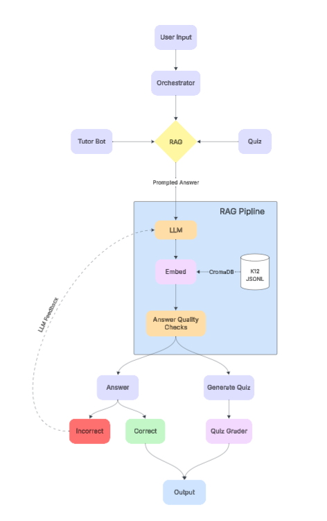

# 📘 EduMate Proposal

---

## Problem & Importance

Education in the 21st century faces a critical gap: while students have unprecedented access to digital tools, most lack guided, structured, and **adaptive learning support**. Current tutoring solutions often fall short in three ways:  

1. **Over-reliance on answers** – many AI tutors simply provide solutions instead of fostering deep understanding.  
2. **Limited personalization** – existing platforms struggle to account for prior mistakes, progress history, and learning style.  
3. **Fragmented communication** – parents and educators are left without clear insights into student performance.  

Meanwhile, tutoring shortages and rising costs make scalable, reliable AI solutions urgent. EduMate aims to address these shortcomings by orchestrating multi-path tutoring workflows, integrating Retrieval-Augmented Generation (RAG), adaptive quizzes, and parent-facing dashboards.

---

## Prior Systems & Gaps

### Conversational LLM Tutors  
Large language models (ChatGPT, Gemini, etc.) are strong in general explanation, but:  
- They frequently **skip step-by-step reasoning**, which is critical for math/science learning.  
- They exhibit **sycophancy**, reinforcing incorrect answers rather than correcting them.  
- They lack persistent **student memory**, treating every session as disconnected.  

### Gamified Apps (Duolingo, etc.)  
Gamified platforms retain engagement with rewards and streaks but:  
- Are domain-specific (languages, music, basic math).  
- Do not maintain **conceptual knowledge graphs** across sessions.  
- Fail to provide **parent/teacher visibility** into student growth.  

### Retrieval-based Engines (Perplexity, etc.)  
Citation-rich engines excel at factual lookups but:  
- Do not act as tutors.  
- Provide information, not **guided workflows** or learning loops.  
- Lack personalization and student modeling.  

---

## Proposed Approach

EduMate builds on a **multi-agent + RAG workflow**, specifically designed for **step-level tutoring**, **adaptive quizzes**, and **transparent reporting**.  

### 🔄 Step-by-Step Workflow

1. **User Input**  
   - A student asks a question or requests a quiz.  

2. **Orchestrator**  
   - Routes the input to either the **Tutor Bot** (guided hints) or **Quiz Module**.  

3. **RAG Pipeline**  
   - Input → LLM → Embeddings → ChromaDB (K–12 data) → Retrieved context.  
   - Answer draft passes through **Answer Quality Checks**.  

4. **Tutor Bot Path**  
   - Provides Socratic hints, breaking problems into smaller steps.  
   - Weak/unclear answers are reinforced with an **LLM feedback loop**.  

5. **Quiz Path**  
   - **Generate Quiz**: Creates adaptive, concept-targeted questions.  
   - **Quiz Grader**: Evaluates answers, highlights mistakes, provides corrective explanations.  

6. **Feedback Loop**  
   - Correct answers reinforce confidence and mastery.  
   - Incorrect answers trigger corrective guidance.  
   - **Parent dashboard updates** with student progress, strengths, and weak areas.  

7. **Output**  
   - Students receive answers, quizzes, and real-time feedback.  
   - Parents/educators see reports and insights.  

---

## Workflow Diagram

Below is the **EduMate workflow overview**:

(*Replace with actual screenshot once finalized*)  

---

## EduMate’s Value Proposition

EduMate provides **genuinely personalized tutoring** that integrates reasoning, adaptive quizzes, and transparent reporting:  

- **For Students**  
  - Encourages learning through guided hints, not just answers.  
  - Builds mastery via adaptive quizzes tailored to weaknesses.  
  - Engages learners through streaks, rewards, and gamified elements.  

- **For Parents**  
  - Provides **weekly dashboards** showing learning progress.  
  - Ensures visibility into whether the AI is helping, not cheating.  
  - Offers confidence that the system is pedagogically sound.  

- **For Educators / After-School Staff**  
  - Simplifies progress tracking and student monitoring.  
  - Auto-generates reports, quizzes, and feedback summaries.  
  - Reduces tutor burnout by offloading repetitive grading tasks.  

---

## Initial Risks & Mitigation

- **Safety**: Ensure no unrelated or distracting outputs; content stays strictly academic.  
- **Privacy**: Student interactions stored securely and never exposed publicly.  
- **Bias**: Responses must be consistent, encouraging, and non-discriminatory.  
- **Reliability**: Robust quality checks to prevent vague or incorrect tutoring.  

---

## Plan for Next Phase (Checkpoint 2)

- **Benchmark Existing Tools** (ChatGPT, Copilot, Duolingo, Perplexity).  
- **Evaluate Step-Level Tutoring**: Can tools spot mistakes and provide hints?  
- **Quiz Generation Tests**: Accuracy and appropriateness of AI-created quizzes.  
- **Latency/UX Measurement**: Identify pain points and optimize EduMate design.  

---

